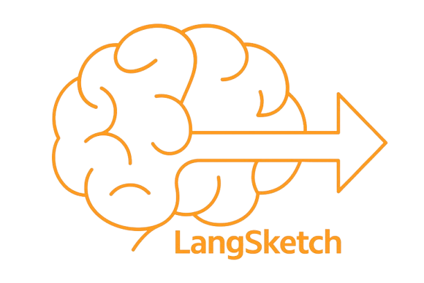
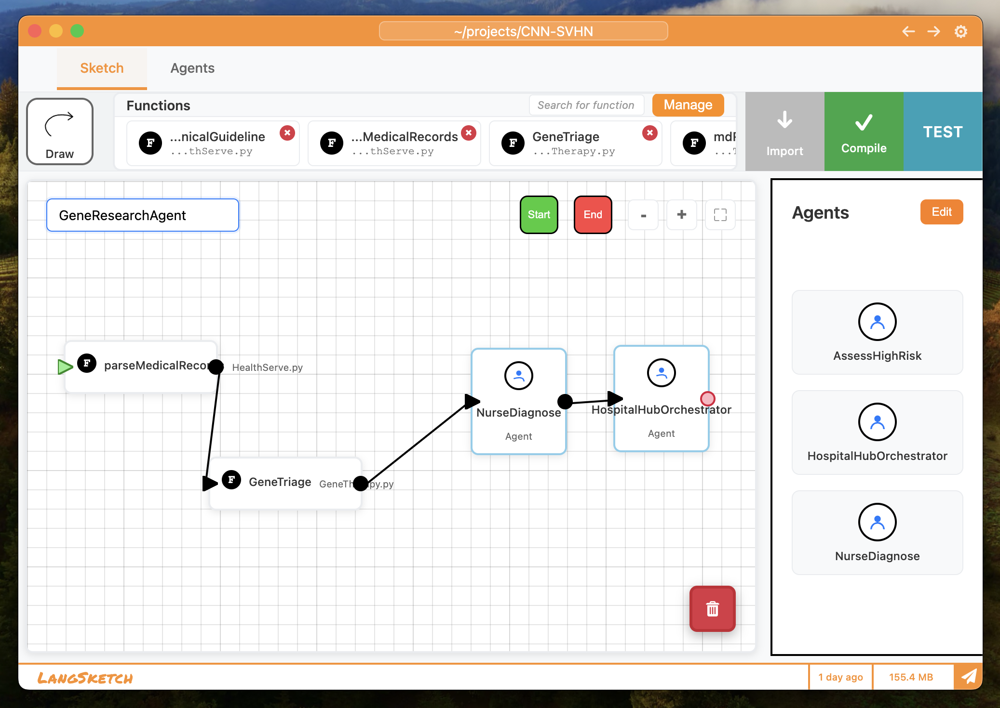
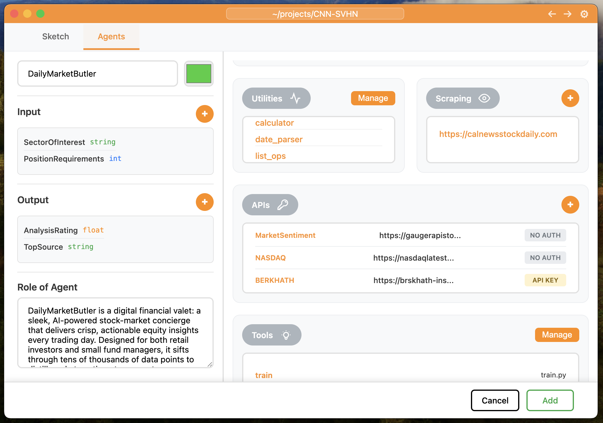

<div align="center">
    
</div>
<h1 align="center">
    LangSketch — Visual AI Agent Builder
</h1>
<p align="center">
   Create multi-agent workflows in seconds
</p>

[](https://github.com/user-attachments/assets/3d13607c-3469-4cb9-af19-944cf5ae1f13)





## How It Works

1. **Configure**: Set up your agents by defining inputs/outputs, attaching RAG documents, connecting external APIs, and adding tools
2. **Sketch**: Arrange and connect multiple agents and tools on the canvas to build complex workflows visually
3. **Integrate**: Link agents with your own codebase so your functions become part of the workflow
4. **Run**: Execute the workflow directly and watch your agents collaborate in real time
5. **Refine**: Adjust agents, connections, or prompts iteratively to optimize performance

## Quick Start

### Prerequisites

- Express.js 5.1+
- Python 3.10+
- Uvicorn 
- API keys for Databricks and Martian (free at signup)

### Frontend Setup

```bash
npm install
```
```bash
npm start
```

### Backend Setup

```bash
cd backend
```
```bash
uv sync
```
```bash
uv run uvicorn src.main:app --reload --host 0.0.0.0 --port 8000
```

## Inspiration

Creating agents is difficult, and integrating them into existing workflows often requires a great level of expertise

**LangSketch** solves this by enabling the entire process in seconds, seamlessly fitting into the tools developers already use

[View on Devpost](https://devpost.com/software/langsketch?_gl=1*qgexxq*_gcl_au*MTczMTUzNjIzMi4xNzU4MDQzOTc1*_ga*MTE1MzAzMzg1My4xNzU4MDQzOTc1*_ga_0YHJK3Y10M*czE3NTgwNDM5NzQkbzEkZzEkdDE3NTgwNDM5ODUkajQ5JGwwJGgw)
